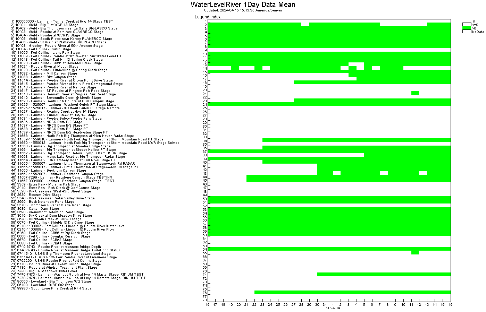

# point-data-check #

*   [Purpose of the Workflow](#purpose-of-the-workflow)
*   [Workflow Files](#Workflow-files)
*   [Workflow Overview](#workflow-overview)
*   [Workflow Results](#workflow-results)
*   [License](#license)

-----------------

## Purpose of the Workflow ##

The purpose of this workflow is to read time series from NovaStar data web services
and do a shallow analysis that data collection for NovaStar points (sensors)
results in at least one data value each day.
This should result in a positive result (at least one value each day) for:

*  stations that are configured with regular report interval of one day or less
*  data imports from other data sources
*  equations

Any gaps in data should should either be due to known issues or require additional investigation and actions.

The workflow can be copied and modified for a specific system
by defining properties at the top of the workflow.

## Workflow Files ##

The following input files are used with the workflow:

| **File** | **Description** |
| -- | -- |
| `point-data-count.tstool` | TSTool command file to run the workflow. |
| `point-data-count-heatmap-template.tsp | TSTool template heatmap time series product. |
| `point-data-count-symtable.csv | Color table for the heatmap. |

## Workflow Overview ##

This workflow checks that data are being collected for every point in a system.
The workflow logic outline is as follows.

1.  Set workflow configuration properties including the period for time series data and
    datastore name:
    *   **`Datastore`** - use a datastore name that is configured for the system
    *   **`Period`** - Typically a relatively short period (e.g., 7 days) is analyzed,
        but a longer period (e.g., 30 days) can be analyzed if necessary
    *   **`CheckStatistic`** - controls what statistic is used for the analysis,
        ideally `Count` but web services prior to version 1.10.1 did not offer the `Count` statistic.
2.  Determine list of time series:
    *   Read all time series using `ReadData=False` to get time series metadata.
    *   All `IrregSecond` interval time series are read, which should represent scaled
        value and corresponding rated value time series.
    *   Measured or imported time series with a different interval are not currently analyzed
        but may be added in the future.
3.  Perform the analysis for each data type:
    1.  Read `1Day` interval data for statistic `Count` (or `Mean` if the data web services version is less than 1.10.1).
    2.  Create output tables files:
        *   `CheckResults.csv` - list of days for which time series for all data types
        *   `CheckResults-${DataType}.csv` - list of days for which time series for a data type do not have data
        *   `point-data-count-heatmap-${DataType}.tsp - time series product heatmap for the specific data type, used to create the heatmap
        *   `point-data-count-heatmap-${DataType}.png - time series product heatmap image for the specific data type

## Workflow Results ##

The workflow results will be similar to the following:

*   The numbered legend on the left lists stations.
*   The y-axis numbers match the legend.
*   The x-axis is days in the analysis period.
*   Any green heatmap cells indicate that at least one value was retrieved in a day.

The heatmap indicates the following:

*   Any rows that are completely green are stations that are collecting data:
    +   No action is needed, although more detailed (sub-day) analysis may indicate issues at a more granular time scale.
*   Any rows that are completely white are stations that are not collecting data:
    +   If the station is a test station, remove the station or set `Test=true` in the station description
        to filter out of default web services output.
    +   If the station is retired, remove the station or set `Status=retired` in the station description
        to filter out of default web services output.
    +   If the station did not collect data in the early period but did collect data in the later period,
        it may be a new station or a station that was turned on after previously being winterized.
    +   If all stations are not receiving data at the same time, possible causes are:
        -   ALERT receiver/decoder is offline
        -   data source is not properly configured in NovaStar
        -   NovaStar software bug
    +   If a station was receiving data but is no longer receiving data:
        -   Could be a problem with the station configuration in NovaStar.
        -   Could be a problem with the station hardware.

## Outstanding Issues ##

See the repository issues.

## License ##

[Creative Commons BY-SA 4.0](https://creativecommons.org/licenses/by-sa/4.0/)
