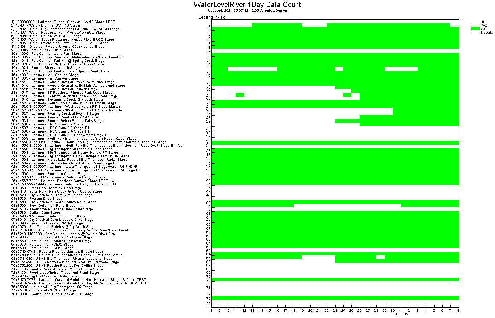

# point-data-count #

*   [Purpose of the Workflow](#purpose-of-the-workflow)
*   [Workflow Files](#Workflow-files)
*   [Workflow Overview](#workflow-overview)
*   [Workflow Results](#workflow-results)
*   [Outstanding Issues](#outstanding-issues)
*   [Release Notes](#release-notes)
*   [License](#license)

-----------------

## Purpose of the Workflow ##

The purpose of this workflow is to read time series from NovaStar data web services
and do a rough analysis to check whether data collection is working for all for NovaStar points (sensors).
The analysis checks whether at least one data value was collected each day,
which should result in OK (at least one value each day) for:

*  stations that are configured with regular report interval of one day or less
*  data imports from other data sources
*  equations

Any gaps in data should should either be due to known issues or require additional investigation and actions.

The workflow can be copied and modified for a specific system
by defining properties at the top of the workflow.

## Workflow Files ##

The following input files are used with the workflow:

| **File** | **Description** |
| -- | -- |
| `point-data-count.tstool` | TSTool command file to run the workflow. |
| `point-data-count-heatmap-template.tsp` | TSTool template heatmap time series product. |
| `point-data-count-symtable.csv` | Color table for the heatmap. |

## Workflow Overview ##

This workflow checks that data are being collected for every point in a system.
The workflow sequence is as follows.

1.  Set workflow configuration properties:
    *   **`Datastore`** - use a datastore name that corresponds to data web services for the system
    *   **`Period`** - yypically a relatively short period (e.g., 7-30 days) is analyzed,
        but a longer period can be analyzed if necessary
    *   **`CheckStatistic`** - indicates the statistic that is used for the analysis,
        ideally `Count` but web services prior to version 1.10.1 did not offer the `Count` statistic.
2.  Determine list of time series and corresponding unique data types:
    *   Read all time series using `ReadData=False` to get time series metadata.
    *   All `IrregSecond` interval time series are read, which should represent scaled
        value and corresponding rated value time series.
    *   Measured or imported time series with a different interval are not currently analyzed
        but may be added in the future.
3.  Perform the analysis for each data type:
    1.  Read `1Day` interval data for statistic `Count` (or `Mean` if the data web services version is less than 1.10.1).
    2.  Create output tables files:
        *   `CheckResults.csv` - list of days for which time series for all data types
        *   `CheckResults-${DataType}.csv` - list of days for which time series for a data type do not have data
        *   `point-data-count-heatmap-${DataType}.tsp` - time series product heatmap for the specific data type, used to create the heatmap
        *   `point-data-count-heatmap-${DataType}.png` - heatmap image for the specific data type

## Workflow Results ##

The workflow results will be similar to the following:

*   The numbered legend on the left lists stations that have time series for the data type.
*   The y-axis numbers match the legend.
*   The x-axis is days in the analysis period.
*   Any green heatmap cells indicate that at least one value was retrieved in a day.
*   White indicates no data for the day.

The heatmap indicates the following:

*   Any rows that are completely green are stations that are collecting data:
    +   No action is needed.
    +   A more detailed analysis (e.g., sub-day analysis for ALERT2 stations) may indicate issues at a more granular time scale.
*   Any rows that are completely white are stations that are not collecting data:
    +   If the station is a test station, remove the station from the database or set `Test=true` in the station description
        to filter out of default web services output.
    +   If the station is retired, remove the station from the database or set `Status=retired` in the station description
        to filter out of default web services output.
*   If all or a group of stations are not receiving data at the same time, possible causes are:
    +   The ALERT/ALERT2 receiver/decoder is offline for those stations:
        -   Contact station maintenance personnel.
    +   The data collection program is not properly configured in NovaStar:
        -   Contact TriLynx Systems support if help is required.
    +   NovaStar software bug:
        -   Contact TriLynx Systems support.
*   If a station was NOT receiving data but is now receiving data:
    +   It could be a new station (see the station description for installation date).
    +   It could be a station that was previously winterized and has recently been turned on for the season.
*   If a station was receiving data but is no longer receiving data:
    +   OK if the station is shut down for the winder or has recently been retired.
    +   OK if the station is offline due to extended maintenance (e.g., waiting on hardware).
    +   Could be a problem with the station configuration in NovaStar:
        -   Contact TriLynx systems support if help is required.
    +   Could be a problem with the station hardware:
        -   Contact station maintenance personnel.
*   If a station receives data most of the time but there are periodic gaps:
    +   The station may have received maintenance:
        -   Query data for the `M` flag to confirm and/or contact station maintenance personnel.
    +   If an ALERT/ALERT2 station, there may be radio path or other communication issues.
        -   Contact station maintenance personnel.
    +   If an import, there may have been an interruption in a third-party data system:
        -   Data can be reloaded.  Contact TriLynx support.
    +   A NovaStar software issue may have occurred:
        -   Contact TriLynx support.

## Outstanding Issues ##

See the repository issues.

## Release Notes ##

The following are release notes for this workflow.

*   1.1.0:
    +   Update to use ${Property} for the `DataStore` to provide additional flexibility.
*   1.0.0:
    +   Initial version.

## License ##

[Creative Commons BY-SA 4.0](https://creativecommons.org/licenses/by-sa/4.0/)
